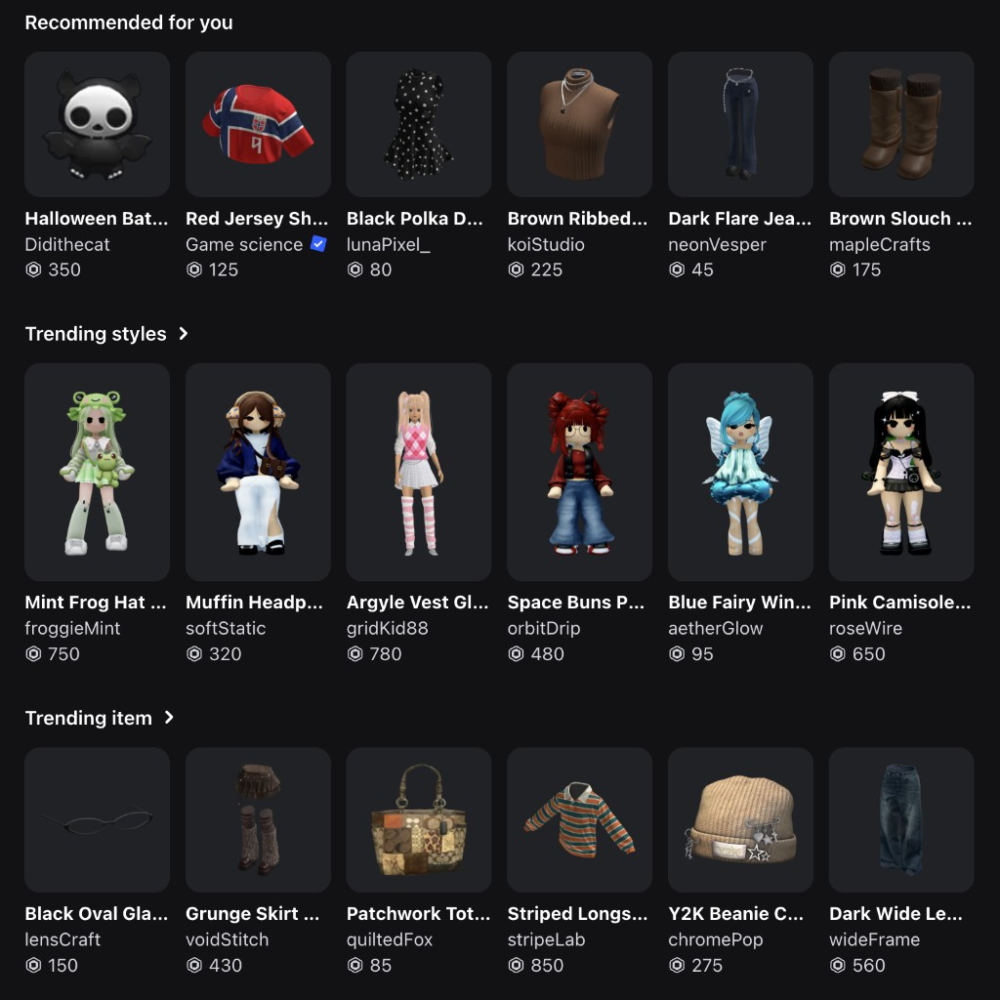

# Item thumbnail library + Thumbnail loader

Real Roblox-style thumbnails plus a Cursor skill that **smart-loads** them into placeholders from UI context — marketplace assets, avatars, profile photos, game thumbnails, and more.



Clone once → install the skill → say **Thumbnail loader** in Cursor. Assets ship in the same repo.

## Install

```bash
git clone https://github.com/zhuoranDeng/item-thumbnail-library.git ~/Documents/item-thumbnail-library
mkdir -p ~/.cursor/skills
ln -sfn ~/Documents/item-thumbnail-library/skills/thumbnail-loader ~/.cursor/skills/thumbnail-loader
```

Clone anywhere else if you prefer; keep the skill symlink pointed at that clone’s `skills/thumbnail-loader`. Optionally set:

```bash
export ITEM_THUMBNAIL_LIBRARY=/path/to/item-thumbnail-library
# or point directly at the assets folder:
# export ITEM_THUMBNAIL_LIBRARY=/path/to/item-thumbnail-library/assets
```

Restart Cursor (or reload the window) so the skill appears.

## Capability

**Thumbnail loader** reads the surrounding UI (row headers, category filters, tile aspect ratio, component names) and fills placeholders with matching library PNGs — it does not invent images.

Typical contexts:

- **Marketplace assets** — clothing, accessories, bodies, makeup, backgrounds, animations
- **Avatars / styles** — full-body looks on taller (2:3) tiles
- **Profile photos** — headshot-style tiles
- **Game thumbnails** — experience / game-card art *(no assets yet — folder empty)*

Also:

- Major RFY / browse rows → mix child subcategory thumbs; subcategory pages → one folder
- Copies into the project’s public/static paths so mocks keep working offline

## Repo layout

```
item-thumbnail-library/
├── README.md
├── preview.png             ← README preview only
├── assets/                 ← all PNGs + manifest (library root)
│   ├── manifest.json
│   ├── shirts/
│   ├── sweaters/
│   ├── avatars/
│   └── …
└── skills/
    └── thumbnail-loader/
        └── SKILL.md
```

| Path | Purpose |
|------|---------|
| `assets/` | Catalog PNGs by category + `manifest.json` |
| `skills/thumbnail-loader/SKILL.md` | Cursor **Thumbnail loader** skill |
| `preview.png` | README image preview |

## Product hierarchy (for RFY / browse)

Paths below are relative to **`assets/`**. Major categories each have an RFY page that **mixes** child subcategory thumbnails:

- **Bodies** — Full bodies, Hair, Heads → `fullbodies/`, `hair/`, `heads/`
- **Clothing** — Shirts, T-shirts, Sweaters, Jackets, Pants, Dresses & Skirts, Bodysuits, Shorts, Shoes
  - Shirts → `shirts/`
  - T-shirts → `t-shirts/`
  - Sweaters → `sweaters/`
  - Other / legacy mixed → `clothing/` (until more subtype folders exist)
- **Accessories** — Head, Face, Neck, Shoulder, Front, Back, Waist, Gear → `accessories/`
- **Backgrounds** → `backgrounds/` — selecting a tile updates the avatar preview panel background
- **Animations** — Bundles, Emotes → `animation/`
- **Makeup** — Eyes, Lips, Faces, Eyelashes, Eyebrows
  - Eyes → `eyes/`
  - Lips → `lips/`
  - Faces / Eyelashes / Eyebrows — (no library folders yet)

Also: `profile-photos/` (headshots), `avatars/` (2:3 full-body character tiles), `game-thumbnails/` (experience cards — **empty for now**).

## Folders (under `assets/`)

| Folder | Use | Count |
|--------|-----|-------|
| `fullbodies/` | Full bodies / character bundles (Bodies subcategory) | 17 |
| `hair/` | Hair and hair+hat sets (Bodies subcategory) | 20 |
| `heads/` | Dynamic heads / faces (Bodies subcategory) | 20 |
| `shirts/` | Shirts (Clothing subcategory) | 14 |
| `t-shirts/` | T-shirts (Clothing subcategory) | 17 |
| `sweaters/` | Sweaters / hoodies (Clothing subcategory) | 20 |
| `clothing/` | Mixed clothing (legacy / other subtypes) | 20 |
| `backgrounds/` | Avatar preview scene backgrounds | 13 |
| `eyes/` | Eyes makeup (Makeup subcategory) | 17 |
| `lips/` | Lips makeup (Makeup subcategory) | 18 |
| `profile-photos/` | Profile photos / headshots | 11 |
| `avatars/` | Full-body avatar characters (**2:3** taller tiles) | 28 |
| `accessories/` | Hats, bags, jewelry, pets, props | 20 |
| `animation/` | Emotes, animation packs | 20 |
| `game-thumbnails/` | Game / experience card thumbnails | 0 (empty) |

## Tile ratios

| Ratio | Assets |
|-------|--------|
| **2:3** (taller) | `avatars/` only |
| **1:1** (square) | All other folders |

## Naming

```
01-short-description.png
```

Prefer **~420×420** PNGs for 1:1 catalog items. Avatar assets are full-body and meant for **2:3** taller tiles.

## Use assets without the skill

```bash
LIB=~/Documents/item-thumbnail-library/assets   # or your clone’s assets/
cp "$LIB/clothing/01-black-polka-dot-dress.png" /path/to/project/public/design/items/1.png
# or symlink the assets folder:
ln -s "$LIB" /path/to/project/public/thumbnails
```

See `skills/thumbnail-loader/SKILL.md` for full fill rules.
